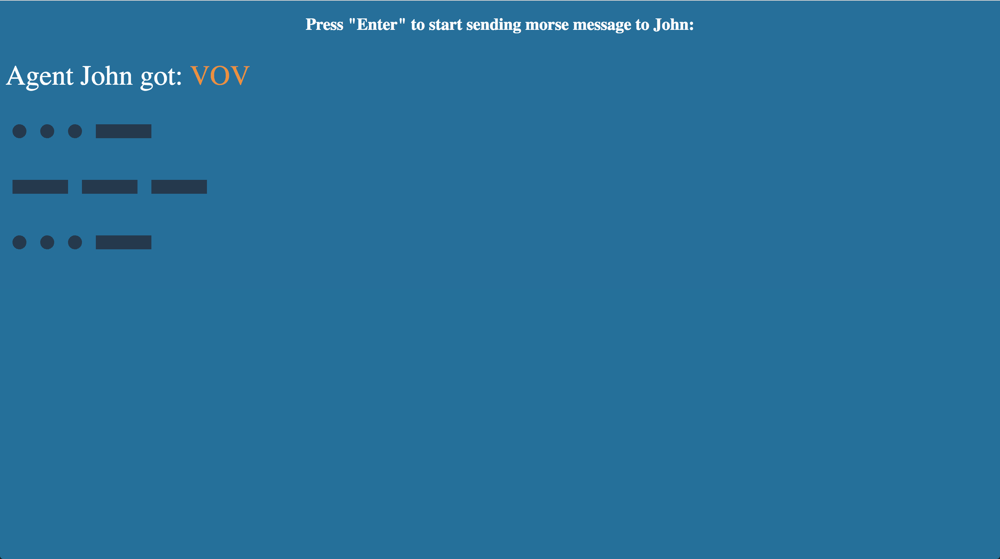

# Morse code

> Thinking in reactive.

This is an exercise project that to help you learn the basic of __Reactive programming__. It will show you how easy it is to use the reactive way to solve the asynchronous data flow/events problems.

We will use [rxjs](https://github.com/ReactiveX/rxjs) to implement a web page which can parse Morse codes to chars.

Before get hands dirty you need to get the brief idea of how does __Morse code__ work. Please refer to [wikipedia](https://en.wikipedia.org/wiki/Morse_code) or [中文](https://zh.wikipedia.org/wiki/%E6%91%A9%E5%B0%94%E6%96%AF%E7%94%B5%E7%A0%81) first.

## Specification

We will use the **Enter** key on the keyboard to send the Morse code:

* To send a __dot__, press `enter` quickly.
* To send a __dash__, press `enter` and hold a while.
* To identify the previous codes are a char, stop press for a longer time.

Before jumping into the example codes, think about the problems we need to face, how to implement it in a normal way. It will be messed up by timers and flag variables.

## Play with the app

To play with the project, just run:

```sh
npm install
npm start
```

It will open your browser with something like below:



If you want to modify the codes and debug them, run:

```sh
npm run debug
```

The project doesn't enable __hot module reload__, but it will watch your changes and recomplie, everytime you change the code you need to refresh the page to get the changes work.

## Marble diagram

There are some marble diagrams in the comments to explain the key algorithms. Refer to [The introduction to Reactive Programming you've been missing](https://gist.github.com/staltz/868e7e9bc2a7b8c1f754) and [rxmarbles](http://rxmarbles.com/) if you don't understand them.

## Exercise

The project just can parse chars, but hasn't implement the ability to detect word breaks. Refer to the wiki to get the idea how to detect a word break, implement this functionality and use your morse parser to send __Hello world__ to agent John.
