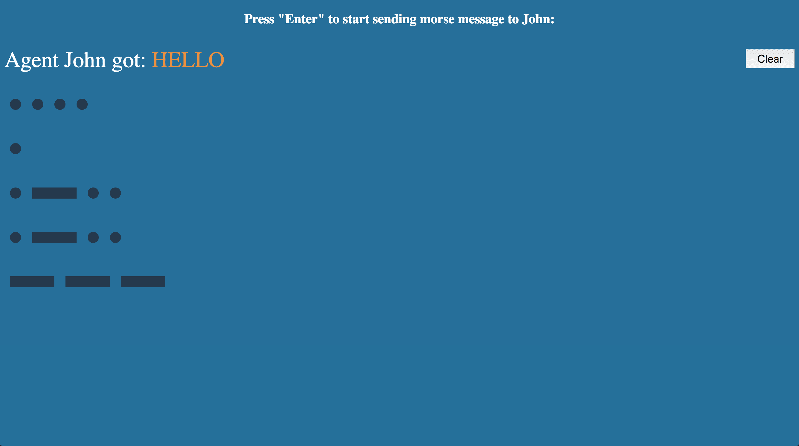

# Morse code

> Thinking in reactive.

This is an exercise project that to help you realize the beauty of __Reactive programming__. It will show you how easy it is to use the reactive way to solve the asynchronous data flow/events problems.

We will use the famous reactive library [rxjs](https://github.com/ReactiveX/rxjs) to implement a web page which can parse morse codes to chars.

Before get hands dirty you need to get the brief idea of __Morse code__. Please refer to [wikipedia](https://en.wikipedia.org/wiki/Morse_code) or [中文](https://zh.wikipedia.org/wiki/%E6%91%A9%E5%B0%94%E6%96%AF%E7%94%B5%E7%A0%81) first.

## Play with the app

To play with the project, just run:

```sh
npm install
npm start
```

It will open your browser with some thing below:



If you want to modify the codes and debug them, run:

```sh
npm run debug
```

The project doesn't enable __hot module reload__, but it will watch your changes and recomplie, everytime you change the code you need to refresh the page to get the changes work.

## Exercise

The project just can parse chars, but hasn't implement the ability to detect word breaks. Refer to the wiki to get the idea how to detect a word break, implement this functionality and use your morse parser to send __Hello world__ to agent John.
